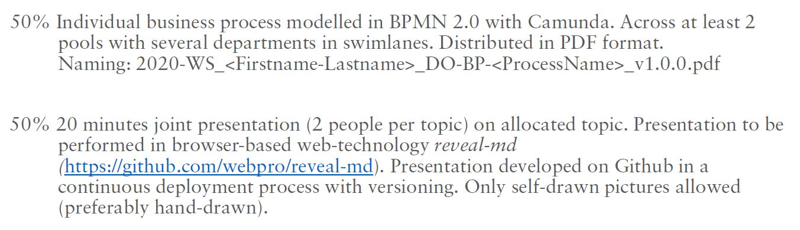

# Digital Organization

20201-SS · v1.0.0

Coursework

---

WHAT — HOW - WHY?

15-20min / person

---

#### 2021-02-25

- Hierarchy — a natural order? 
  DN+JP

- Organizational Culture 
  VA+LV

- Exponential Organization 
  DS+SM

---

#### 2021-03-04

- Ambidextrous Organization 
  NP+AO
- Holacracy  
  n.a.
- Reinventing Organization 
  EO+SN

---

#### 2021-03-11

- Morningstar, Sipgate, Buffer incl. Salary Systems (https://buffer.com/resources/salary-formula-changes-2019/
  )
   
  TB+NK

---

## Objectives

We want to achieve the following situation:

- Each of you has a GitHub account.

- In this account is an individual repository that is cloned as a folder onto your local harddrive, e.g. `2021-ss_doab` or `2021-ss_docd`

---

## Objectives (ctd.)

- In this locally cloned folder is a test file with your test presentation `slides.md` for you to practice working with `VS Code`, `reveal-md`, `GitHub Desktop`, `commits`, `push` and of course `Markdown`.

---

## Objectives (ctd.)

- Then you and your partner will use one of your accounts to setup a joint repository `2020-ws_doabcd` for your coursework.

- You can then both commit to this common folder.

- On the day of your presentation, clone the common repository to a local harddrive and present it.

---
